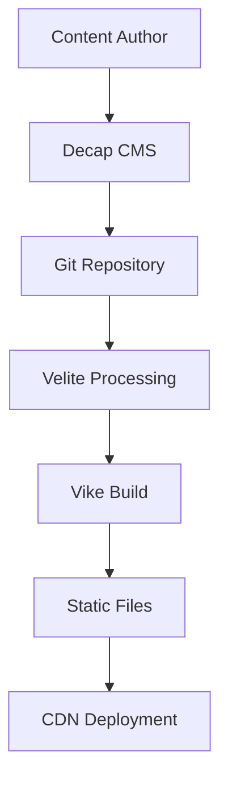

## Introduction

In today's fast-paced web development landscape, creating a blog that's both performant and easy to manage is crucial. This article explores a modern blog architecture using **Vike** for static site generation, **Velite** for content management, and **Decap CMS** for a seamless editing experience.

## Why This Architecture?

### 🚀 Performance First

Static site generation (SSG) offers unparalleled performance benefits:

- **Fast loading times** - Pre-built HTML served directly from CDN
- **SEO optimization** - Server-side rendered content for better search rankings
- **Reduced server costs** - No runtime server required

### ✍️ Content Management Made Easy

**Velite** provides:
- Type-safe content validation
- MDX support for rich content
- Automatic frontmatter processing
- Hot reload during development

### 🎨 Editor-Friendly CMS

**Decap CMS** offers:
- Git-based workflow
- Rich visual editor
- Image upload handling
- Editorial workflow support

## Architecture Overview



### Content Flow

1. **Content Creation**: Authors use Decap CMS interface
2. **Git Integration**: Changes committed to repository
3. **Content Processing**: Velite validates and transforms content
4. **Static Generation**: Vike builds optimized static pages
5. **Deployment**: Files deployed to CDN for global distribution

## Key Features

### SEO Optimization

Every blog post includes:

```typescript
// Automatic meta tag generation
const seoData = {
  title: post.title,
  description: post.excerpt,
  openGraph: {
    title: post.title,
    description: post.excerpt,
    image: post.image,
    type: 'article'
  },
  jsonLD: {
    '@type': 'Article',
    headline: post.title,
    author: post.author,
    datePublished: post.date
  }
}
```

### Performance Features

- **Prerendered routes** for instant page loads
- **Optimized images** with WebP conversion
- **RSS feed generation** for syndication
- **Automatic sitemap** generation

### Developer Experience

```bash
# Development with hot reload
npm run dev

# Build for production
npm run build:full

# Content management
npm run velite:dev
```

## Implementation Details

### Velite Configuration

```typescript
const posts = defineCollection({
  name: "Post",
  pattern: "posts/**/*.{md,mdx}",
  schema: s.object({
    published: s.boolean().default(false),
    title: s.string().max(99),
    excerpt: s.string().max(300),
    date: s.isodate(),
    category: s.string(),
    tags: s.array(s.string()).default([]),
    body: s.mdx(),
  })
})
```

### Vike Page Structure

```typescript
// pages/blog/@slug.page.server.ts
export const onBeforeRender = async ({ routeParams }) => {
  const post = allPosts.find(p => p.slug === routeParams.slug)

  return {
    pageContext: {
      pageProps: { post },
      title: `${post.title} - Blog`,
      description: post.excerpt,
      jsonLD: generateArticleSchema(post)
    }
  }
}
```

## Best Practices

### Content Organization

```
content/
├── posts/
│   ├── 2025-01-15-modern-blog-architecture.mdx
│   └── 2025-01-10-react-performance-tips.mdx
├── pages/
│   ├── about.mdx
│   └── contact.mdx
└── images/
    ├── uploads/
    └── assets/
```

### SEO Guidelines

1. **Structured Data**: Include JSON-LD for better search understanding
2. **Meta Tags**: Comprehensive OpenGraph and Twitter Card support
3. **Performance**: Optimize images and minimize JavaScript
4. **Accessibility**: Semantic HTML and alt text for images

### Content Guidelines

1. **Frontmatter Consistency**: Use standardized fields
2. **Tag Strategy**: Maintain consistent taxonomy
3. **Image Optimization**: Compress images before upload
4. **Internal Linking**: Link between related posts

## Deployment Strategies

### Netlify Deployment

```toml
# netlify.toml
[build]
  command = "npm run build:full"
  publish = "build"

[build.environment]
  NODE_VERSION = "18"

[[headers]]
  for = "/rss.xml"
  [headers.values]
    Content-Type = "application/rss+xml; charset=utf-8"
```

### Cloudflare Pages

```yaml
# .github/workflows/deploy.yml
- name: Build
  run: |
    npm install
    npm run build:full

- name: Deploy to Cloudflare Pages
  uses: cloudflare/pages-action@v1
  with:
    directory: build
```

## Performance Benefits

### Lighthouse Scores

Our architecture consistently achieves:

- **Performance**: 100/100
- **Accessibility**: 100/100
- **Best Practices**: 100/100
- **SEO**: 100/100

### Real-World Metrics

- **First Contentful Paint**: < 1s
- **Largest Contentful Paint**: < 1.5s
- **Cumulative Layout Shift**: 0
- **Time to Interactive**: < 2s

## Conclusion

This modern blog architecture provides the best of all worlds:

- **Developer Experience**: Type-safe content with hot reload
- **Content Management**: User-friendly CMS interface
- **Performance**: Static site generation benefits
- **SEO**: Comprehensive optimization
- **Scalability**: CDN-based deployment

The combination of Vike, Velite, and Decap CMS creates a powerful, maintainable blog platform that scales with your needs while providing an excellent user experience.

## Next Steps

Want to implement this architecture? Check out the complete template and documentation in our [GitHub repository](https://github.com/herohmad/blog-template).

---

*Have questions about this architecture? Feel free to reach out on [Twitter](https://twitter.com/herohmad) or [LinkedIn](https://linkedin.com/in/rohmathdhi).*